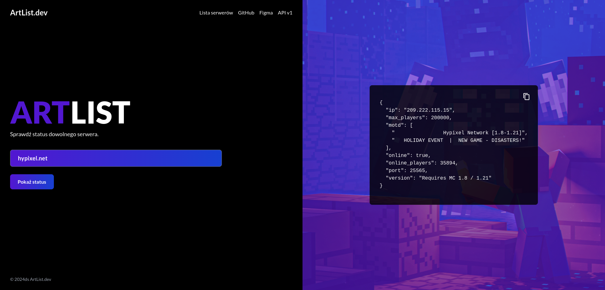

<!-- PROJECT LOGO -->
 

  
  <h3 align="center">McServerApi</h3>
  
    Check the status of any Minecraft server!
     
    <a href="https://github.com/Wojtazzzz/mc_server_api/">View Code</a>
    ·
    <a href="https://github.com/Wojtazzzz/mc_server_api/issues/new?labels=bug&template=bug-report---.md">Report Bug</a>
    ·
    <a href="https://github.com/Wojtazzzz/mc_server_api/compare">Create Pull Request</a>
  

<!-- BUILT WITH -->
### Built With

This section should list any major frameworks/libraries used to bootstrap your project. Leave any add-ons/plugins for the acknowledgements section. Here are a few examples.

* [Elixir](https://elixir-lang.org/)
* [Phoenix Framework](https://www.phoenixframework.org/)
* [Tailwind](https://tailwindcss.com/)

(<a href="#readme-top">back to top</a>)

<!-- ABOUT THE PROJECT -->
## About The Project

